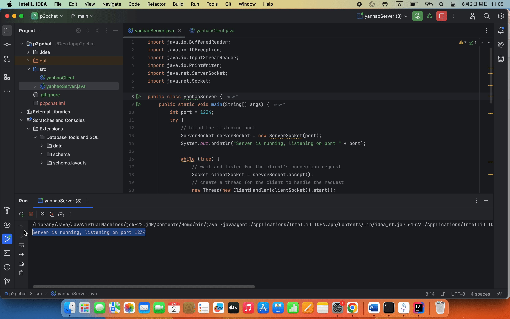
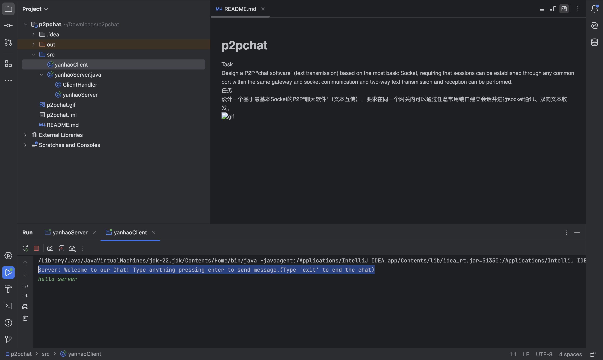
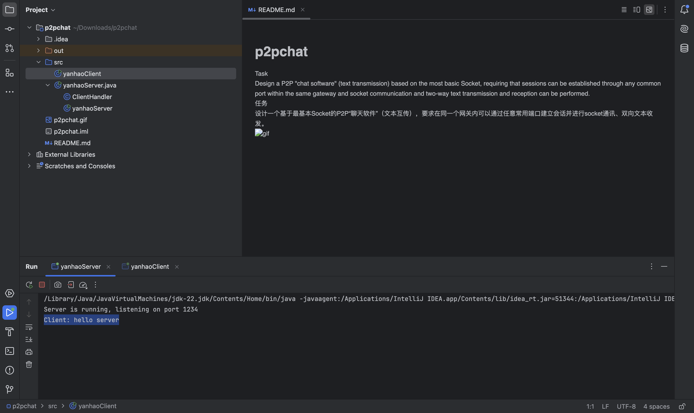
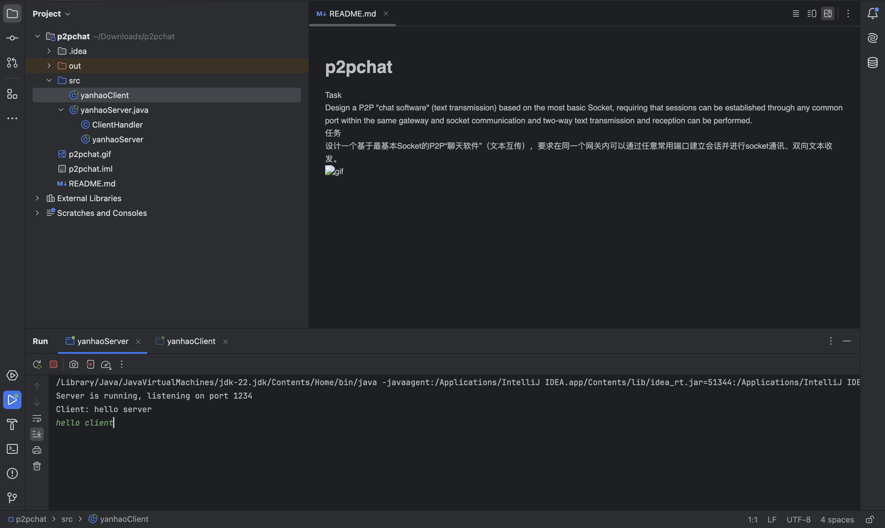
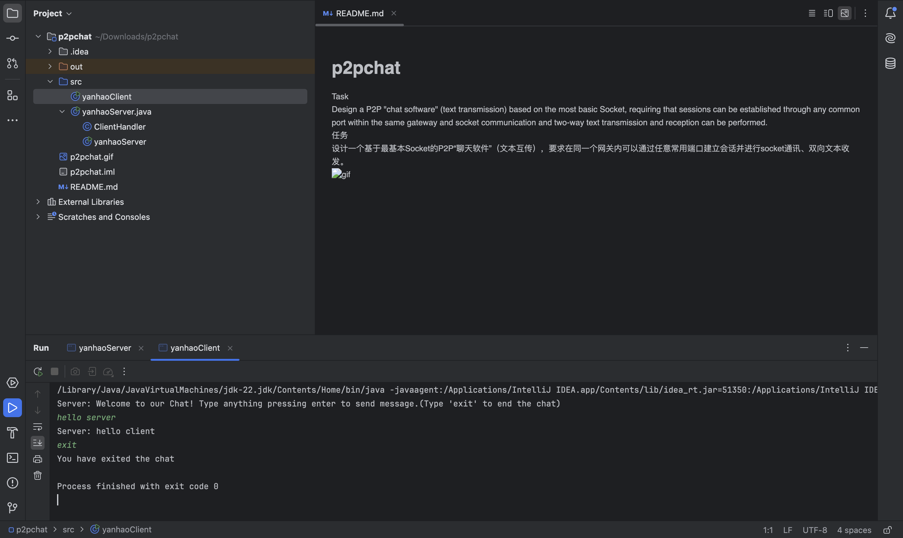
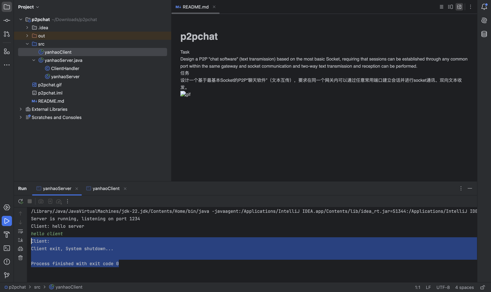
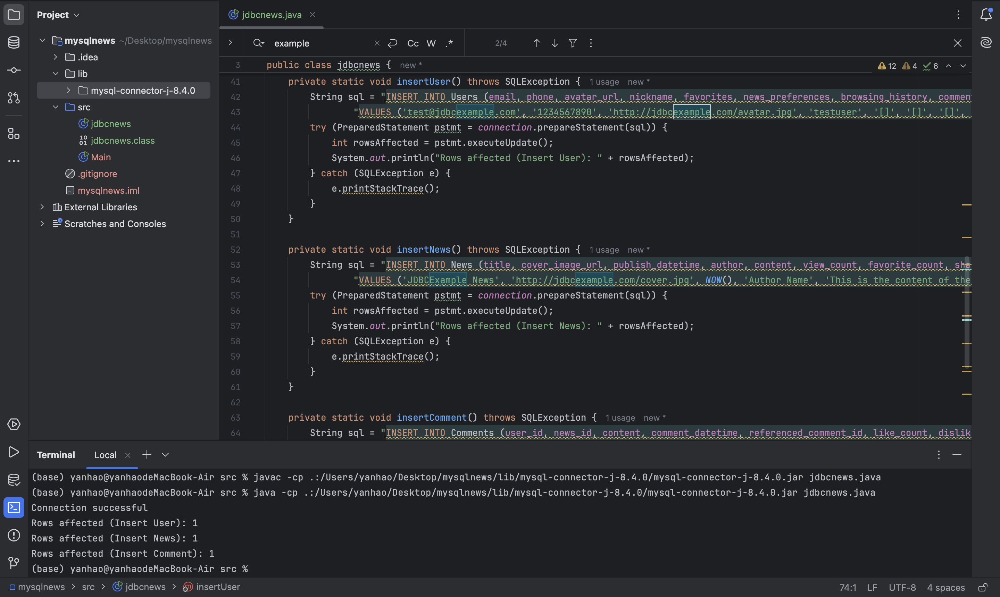

# wk1-socket-jdbc
wk1-wk8 is my software engineer summer intern 24'

Task1 is to design a p2p chatbox based on Socket, requiring that sessions can be established through any common port within the same gateway, and socket communication and two-way text sending& receiving can be performed. Task2 is to migrate SQL CRUD instructions to JDBC implementation.

## Socket
cd p2pchat/src, run yanhaoServer.java, yanhaoClient.java, as followed by the Fig.1 below.

    
    
    
    
    
    
    
    
Fig.1 Socket-P2PChat

## JDBC
cd mysqlnews/src, run jdbcnews.java, as followed by the Fig.2 below.

    
    
Fig.2 JDBC-MySQLNews

